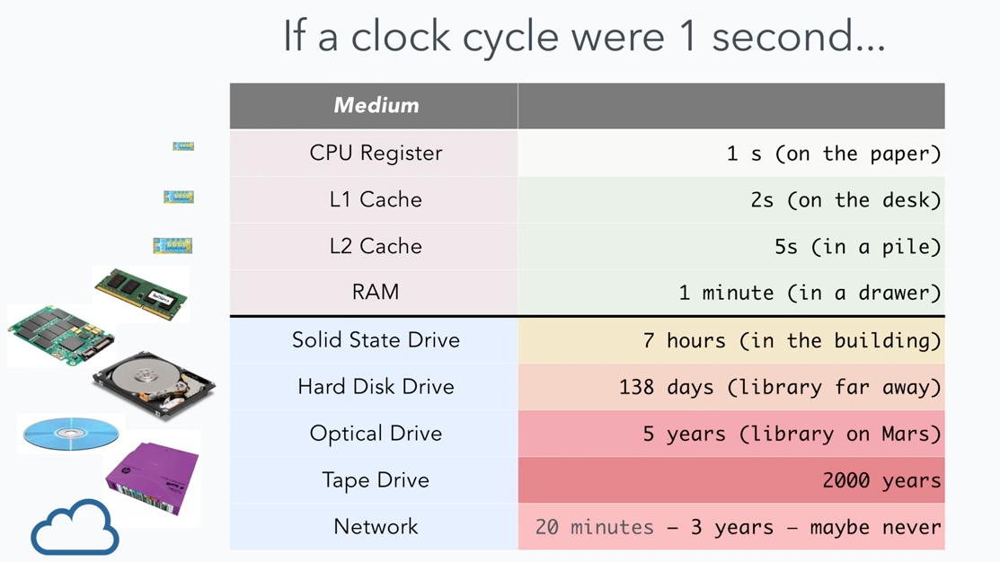

#Intro to Asynchronicity


##Roadmap:
 * What does it mean to say that node is asynchronous?
 * Code demo of asynchronous operations


<br>

##Background:




Accessing external resources happens FREQUENTLY, they have a lot of VARIANCE, and they generally take a LONG TIME. We've been thinking about Big O of our algorithms, but accessing external resources is really the most expensive thing we can do. So it's a big problem...
<br>
<br>
<br>
Here's some PHP:


Let's say it takes the computer 5 seconds to get each text file. What is the minimum amount of time it can take to run this program?

Whats the problem here? Why are we waiting for each read operation to be done? It's nice and simple, BUT, this is a big problem because so much stuff is done over networks now, in particular over the internet. 


This is the problem Ryan Dahl wanted to fix.

 
 
##How is NodeJS 'asynchronous'?
Here's the above PHP script, rewritten in javascript:


Think of it like you're cooking a meal of chicken, rice and vegetables. You don't put the chicken in the oven, then wait until it's done before you start with the other things, right? You get them all started, set some alarms, and let them tell you when they are ready!


##Let's CODE!
We're going to use the fs module to do asynchronous file reads. Co-ordinating asynchronous file operations can be hard, but we will use promises next week to make it easier!


```
var fs = require('fs');

var contents = [];

var first = fs.readFile('./first.txt', function(err, contents){
	console.log(contents.toString())
})
var second = fs.readFile('./second.txt', function(err, contents){
	console.log(contents.toString())
})
var third = fs.readFile('./third.txt', function(err, contents){
	console.log(contents.toString())
})

console.log(first, second, third)

```
##Outro

The best videos on youtube:

[video 1](https://www.youtube.com/watch?v=oHg5SJYRHA0)

[video 2](http://www.youtube.com/watch?v= 8aGhZQkoFbQ)
