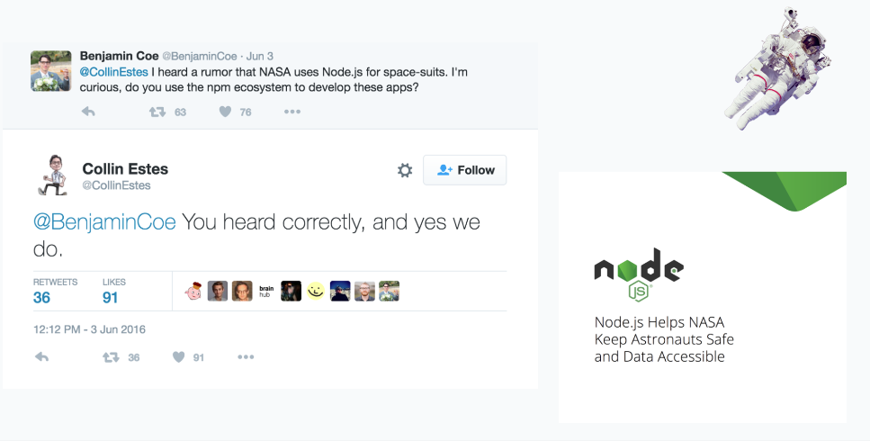
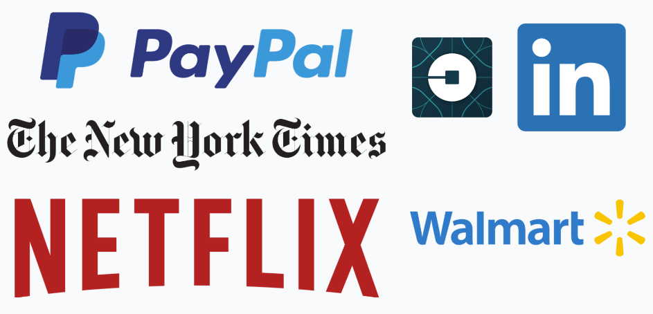
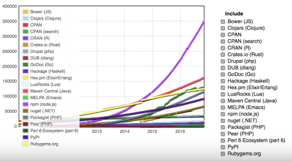

#Node Lesson Intro


##Roadmap:
 * What is Node?
 * Why are modules important?
 * How do I...
 	* make my own modules?
 	* use built-in modules?
 	* use modules from npm?

<br>

##What is NodeJS?
 The makers of nodejs took javascript (which normally runs in the browser) and made it available on your computer.
 <br>

Put another way - they ripped Google Chrome's V8 js engine out of the browser, and put it 'in the computer'. 



Javascript could previously only do stuff within the browser. When you console.log something, it appears in the browser's console. When you alert something, a mini browser window pops up. 

 We love javascript, so let's LIBERATE IT! 


With node, we can do things that the operating system does - open files, make http requests, etc. 

Actually, what we do is we let javascript talk to the OS to get it to do things for us. Previously, our javascript only talked to the browser, and got the browser to do things for us. 

E.g. if we wanted to click a button to get a dog picture to appear, what would we do? Our Javascript would manipulate the DOM - it would put a listener on a DOM node, then make another node appear when the original node was clicked. 

We can think about the browser as a 'wrapper' that wrapped up our javascript engine and let it do things to web pages. 

Now, in order to get the JS to talk to the operating system, we need to give it a new, different wrapper. That different wrapper is called.....

.

.

.

.

.

.

.

.

.

.

.

.

.

.

.

.

.

.

.

.

 
 


####Why are people excited about node?
**It's new and hot** as a company and as employers, want new tech, because they want progressive devs and devs who like to stay on top of things.

**From a company/TECH standpoint** the companies are excited because it allows you to build scalable websites.<br><br>

**From a DEVELOPERS standpoint** we're excited about it because Node gives us so much control!

* Create, control how requests and responses are handles, create sockets and handle sockets 
* Feeling of more low level like C++ but also ruby
* But also excited about this bc it's all written in Javascript, and we're familiar with JS (bring one language from the front-end to the back-end and your able to become full-stack with one language). ONE LANGUAGE TO RULE THEM ALL!


<br>

 

<br>

<!--
Walmart
Began using node in 2012, decided to test their new node platform on black friday.... 53% of their online traffic went thorugh the node servers with zero downtime.

LinkedIn
began developing the server side of their mobile app entirely in node, They were previously using Ruby, but since the switch they have seen big performance increases: 2 - 10x faster

Paypal:
starting experimenting with node using just their Account overview page, but once they saw the 35% speed increase in half the development time, they started moving to node wholesale. 
-->

##History of Node

Here's how the creator of Node, Ryan Dahl, unveiled his invention: 

<a href="http://www.youtube.com/watch?feature=player_embedded&v=ztspvPYybIY" target="_blank"></a>

*  Server-side javascript
*  Built on V8
*  Evented, non-blocking I/O
*  CommonJS module system
*  8000 lines of C/C++


##Environment differences: browser vs node

###some things are the same:
* console
* setTimeout/setInterval

###some things are different:
* window   	
* document
* alert
* history
<br> ---------------------------
* global 
* process
* __dirname and __filename
* Buffer
* require/module

<br>

###Let's run some CODE!

 ```node -v 						``` 
 
 Two ways to get a node process running:
 
 ```
 node  							# ==> starts a node REPL
 node your_filename.js			# ==> starts your JS in node
 ```
 
##Modules

 


###Why use modules?
* Single files have a more defined responsibility
* Easier collaboration
* Visible structure
* Testing


###QUIZZY QUIZ!
What is the browser's module system? E.g. if you were to split up the game of life code, how would you do it? How would you share variables across the files?


###User-defined modules
We use **module.exports** to export things from a file, and **require** to bring them in to a file. 


###Built-In modules
* url - a toolset for parsing components of URLs
* path - toolset for parsing and creating file paths
* fs - utilities for accessing a machine's file system
* http - ability to create servers, and send HTTP messages to other servers
* crypto - tools for encryption


###Community modules (using npm)
Community modules are the best - you can use other peoples' code to do things! This is one of the reasons why people love Rails - there is ALWAYS a 'gem' to do anything you want. Nowadays, there is also a node package for pretty much anything you want to do as well. 


 

